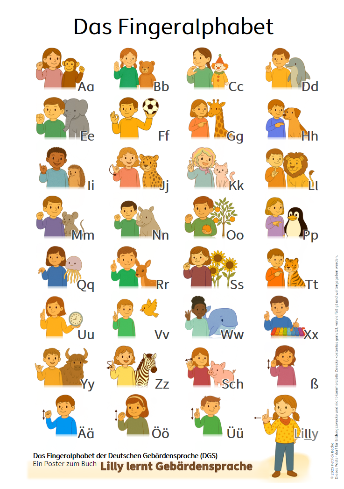

# Poster: Deutsches Fingeralphabet für Kinder

Dieses PDF-Poster gehört zum inklusiven Kinderbuch **„Lilly lernt Gebärdensprache“** und zeigt das **deutsche Fingeralphabet** in einer kindgerechten, liebevoll gestalteten Form.

Es wurde entwickelt, um Kindern einen ersten spielerischen Zugang zur Gebärdensprache zu ermöglichen – z. B. im Kindergarten, in der Schule oder zu Hause.

---

## 📄 Nutzungshinweise

✅ **Erlaubt ist:**
- die Nutzung im Unterricht, in Kitas, zu Hause und in anderen nicht-kommerziellen Bildungskontexten  
- das kostenlose Weitergeben und Vervielfältigen des Posters in unveränderter Form

🚫 **Nicht erlaubt ist:**
- kommerzielle Nutzung (z. B. Verkauf, Einbindung in kommerzielle Produkte)
- Veränderung oder Bearbeitung ohne Rücksprache

---

## 📥 Download

👉 [Hier klicken, um das Poster herunterzuladen](https://github.com/sZPeddy/LillyLernt/raw/main/Fingeralphabet%20A2%20v1.pdf)

Format: DIN A2, PDF  
© 2025 
Lizenz: [CC BY-NC-ND 4.0](https://creativecommons.org/licenses/by-nc-nd/4.0/)

---

## ℹ️ Zum Buch

Mehr zum Buch: [www.amazon.de](https://www.amazon.de)  
